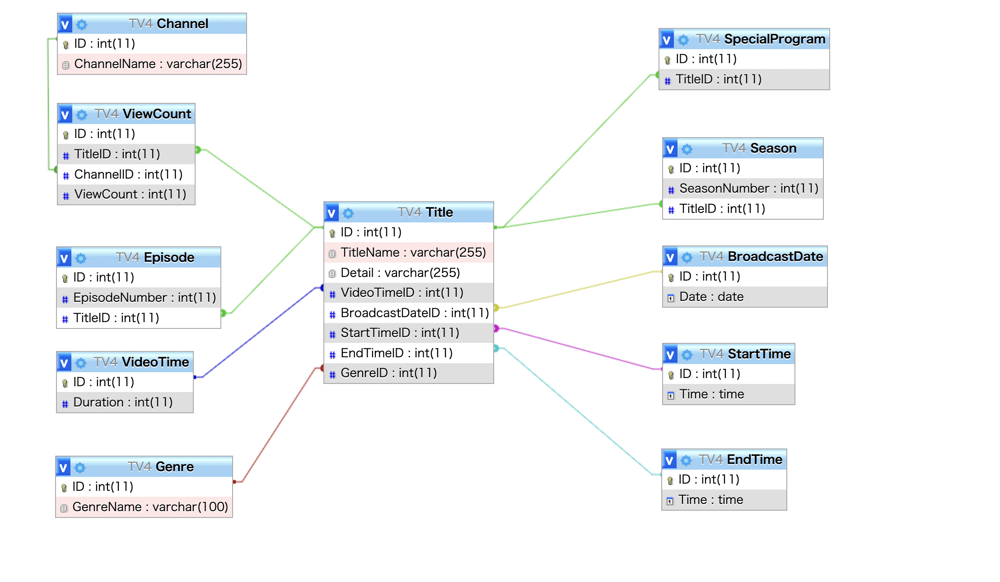

# データベース
データベースを学習するための環境を作っていきます。お題はインターネットTVの番組を管理するデータベースです。
学習環境としてMySQLを使用していきます。

## 前提条件
MySQLのインストールが必須になります。

## データベースを作成
MySQLにログインした後データベースを作り、作ったデータベースを使用します。
```
CREATE DATABASE TV;
USE TV;
```

## テーブルを作成
クローンしたファイルを読み込みます。
```
source /ファイルのパス/create_tables.sql
```
ER図は以下になります。


## サンプルデータの挿入
inport_dataファイルに存在するcsvデータを取り込みます。
```
LOAD DATA LOCAL INFILE 'ファイル名' INTO TABLE テーブル名 FIELDS TERMINATED BY ','   ENCLOSED BY '"' LINES TERMINATED BY '\n'  IGNORE 1 ROWS;
```

以上で準備は完了です。好きなように使用してください。

### アプレンティス、ステップ3のSQL文はsql.SQLに記述してあります。
